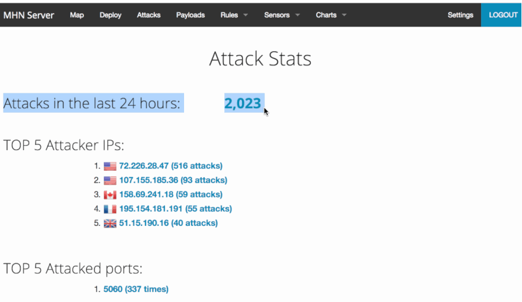

# WEEK-9

In this project, we had to create a honeypot server, is a computer system that is set up to act as a catch cyberattackers, and to detect, or study attempts to gain unauthorized access to information system.

## HoneyPot: Dionaea with HTTP
### Summary
Dionaea is a honeypot whose intention is to trap malwares that are exploiting vulnerabilities exposed by services offered to the network with the ultimate goal of gaining a copy of the attacking malware.

- 

The following tables show the breakdown of the attacks:

Table 1: Attacks Ranking based on the Origin IP

| Rank |    IP Address   | Origin         | # of Attacks |
|:----:|:---------------:|:--------------:|:------------:|
| 1    |72.226.28.47     | USA            | 510          |
| 2    |107.155.185.36   | USA            | 11           |
| 3    |158.69.241.18    | Canada         | 61           |
| 4    |195.154.181.191  | France         | 53           |
| 5    |51.15.190.16     | United Kingdom | 41           |

Table 2: Attacks Ranking based on the Attacked Port 

| Rank | Port # | # of Attacks |
|:----:|:------:|:------------:|
|   1  |  5060  |      335     |
|   2  |   23   |      289     |
|   3  |   445  |      110     |
|   4  |   443  |      109     |
|   5  |  1433  |      54      |
